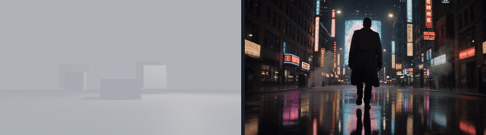

# MovieCrew

A model-agnostic multi-agent pipeline that turns a movie concept into
shot-by-shot video, with a Blender previz stage in the middle so a human — not
a prompt — decides where the camera goes and where the actors stand.

## What it can do today

Block a shot in Blender with grey boxes, send that take to a generative model,
and get the shot back photoreal. **Left: the previz. Right: what came back.**

### The camera follows the previz



A slow push-in blocked in Blender, and the same push-in in the render. Held
against a control with an identical prompt and seed but no previz, the control
cranes up and loses the subject entirely; reverse the previz into a pull-back
and the render pulls back. Direction transfers — rate and magnitude don't.

### Staging and casting follow it too


Four colour-coded marks — a crossing actor, a standing actor, an actor walking
toward camera, and a static prop — with the prompt naming who each colour is.
Every one is cast correctly, screen-space placement holds, and depth transfers
once the previz gives depth something to read (converging road markings,
building masses, haze).

Full-quality clips are in [`docs/media/`](docs/media). What doesn't work yet is
in [Known limits](#known-limits).

## The arc

1. **Plan** — a concept goes through the seven agents and comes out as a
   `Project`: bible, scenes, shots, and a `RenderPlan` of `ShotIntent`s.
2. **Storyboard** — one still per shot for review; approving promotes each
   anchored frame into that shot's reference images.
3. **Previz** — the Blender add-on blocks a camera from the shot's prose and
   renders a take. Every shot can have as many takes as you like.
4. **Generate** — pick a take in the portal, pick a model, and the take is
   sent as the driving reference for a generative render.
5. **Review** — finished renders are downloaded into the takes tree and shown
   in the portal beside the take that drove them, playable and downloadable.

## Running it

### Install

```bash
pip install -e ".[portal,dev]"
python -m pytest        # 371 passing, no key and no network needed
```

The core has no third-party dependencies — the OpenRouter clients are stdlib
`urllib`. That is what lets the package drop into Blender's bundled Python
with nothing to install. `fastapi` and `uvicorn` are for the portal only.

### Offline first

```bash
python -m uvicorn moviecrew.portal.app:app --reload
```

Open http://127.0.0.1:8000. The backend reads **mock**: no key, no network,
nothing spent. Type a concept, hit Generate, and you get a full plan and a
storyboard of stub images. Worth doing before anything costs money.

### Live

```bash
export OPENROUTER_API_KEY='sk-or-...'
export MOVIECREW_TAKES_ROOT=./takes
python -m uvicorn moviecrew.portal.app:app --reload
```

The backend now defaults to **openrouter**, and the storyboard generates real
stills. Point `MOVIECREW_TAKES_ROOT` at wherever the Blender add-on writes —
the folder holding `sc1/sc1-sh1/take_001.mp4`.

> With a key set, one Generate makes seven agent calls plus one image call per
> shot. A ten-shot project is ten image generations. Run mock first, confirm
> the shot list, then switch.

### Generating video from a take

A provider has to fetch your take over the internet, so it needs an address
that isn't loopback — resolving `127.0.0.1` would reach the provider's own
machine:

```bash
export MOVIECREW_PUBLIC_BASE_URL='https://your-tunnel.example.com'
```

A tunnel (cloudflared, ngrok) pointed at port 8000 is the quickest option.
Without it the portal refuses the submit with an explicit message rather than
failing late.

Then in the portal: pick a take → pick a model → **Estimate Cost** →
**Generate**. It polls, downloads into `takes/<scene>/<shot>/renders/`, and
appears in the Renders gallery with a Download link.

### CLI

```bash
python -m moviecrew "A lone man in a rain-slicked neon city." \
  --backend openrouter --out project.json
```

`--backend` takes `mock`, `openrouter`, or `anthropic`.

## Configuration

| variable | what it does |
| --- | --- |
| `MOVIECREW_TAKES_ROOT` | where Blender writes takes and renders are stored. Server-side only — a browser cannot redirect it. |
| `OPENROUTER_API_KEY` | opts every stage into live models — agents, storyboard stills, and renders. Without it the portal runs `MockLLMClient`, `MockImageProvider` and `FakeRenderClient`, and spends nothing. |
| `MOVIECREW_PUBLIC_BASE_URL` | an address a provider can fetch takes from. Required for models that drive motion from a video. |
| `ANTHROPIC_API_KEY` | only for the direct-to-Anthropic LLM backend (`--backend anthropic`), which bypasses OpenRouter. |

## Models

One key covers all three stages:

| stage | default model | why |
| --- | --- | --- |
| agents (concept → plan → prompts) | `anthropic/claude-sonnet-5` | one model across all seven agents keeps a project's voice consistent and the price predictable |
| storyboard stills | `google/gemini-2.5-flash-image` | returns images through the same chat-completions endpoint |
| renders | `bytedance/seedance-2.5` | accepts a previz take as a driving video reference |

The direct-to-Anthropic backend routes per task instead — Opus for the
director and continuity passes, Haiku for the editor.

Renders land in `<takes root>/<scene>/<shot>/renders/<job id>.mp4`. They are
downloaded rather than linked: a provider URL expires, and the render cost
real money.

## Known limits

Measured, not guessed — each of these came out of a live render.

- **Which actor performs which action is unstable.** The *set* of staged
  behaviours arrives intact; the mapping onto characters re-rolls between
  generations. Identical previz, prompt and seed have produced different
  assignments. Distinct per-character proportions in the previz are the next
  thing to try.
- **Rate and magnitude don't transfer, only direction.** A previz that travels
  1.23× over 8 seconds produced a render that travelled 1.10× over 5.
- **Depth needs cues.** Marks floating in an empty void get flattened into one
  plane near the lens, and a pure Z move vanishes. A floor, walls, converging
  lines and haze fix it.
- **Reference media must serve a real MIME type.** `raw.githubusercontent`
  returns `application/octet-stream` and the clip is silently ignored — the
  render succeeds, bills in full, and simply doesn't use your previz.
- **Hosting takes is unsolved.** `MOVIECREW_PUBLIC_BASE_URL` plus a tunnel
  works, but it isn't a product answer.

## Layout

- `moviecrew/schema.py` — the shared vocabulary as stdlib dataclasses:
  `Bible`, `Scene`, `Shot`, `ShotIntent`, `ContinuityFlag`, `RenderPlan`,
  `Project`. `ShotIntent` is the centre: what a shot should be, in terms no
  backend owns, carrying no vendor's limits.
- `moviecrew/agents.py`, `crew.py` — the seven agents and the orchestrator.
- `moviecrew/llm.py` — `LLMClient` and the direct Anthropic backend.
  `llm_openrouter.py` routes the same interface through OpenRouter.
- `moviecrew/image.py`, `image_openrouter.py` — storyboard stills.
- `moviecrew/video.py` — the Veo execution boundary. Owns `VeoPrompt` and
  `veo_prompt()`, the adapter where Veo's clip lengths, reference cap and
  legal aspect ratios are applied — and the only place they are.
- `moviecrew/render.py` — the backend-neutral render abstraction: submit,
  poll, fetch, and a `capabilities()` callers branch on instead of a backend
  name. `render_openrouter.py` implements it; `FakeRenderClient` is the
  offline default.
- `moviecrew/takes.py` — the take model: scene → shot → numbered take, a
  filesystem convention with a rebuildable manifest.
- `moviecrew/blocking.py` — shot prose into camera geometry. No `bpy`, so it
  is tested without Blender.
- `blender/moviecrew_blender/` — the add-on: load a project, block a shot,
  render a take.
- `moviecrew/portal/` — the FastAPI backend and the single-page front end.

## Development

```bash
pip install -e ".[dev]"
python -m pytest
python -m pyflakes moviecrew tests
```

No API key or network access is required to run the tests — every backend has
an offline implementation, and the live ones take an injectable transport.
